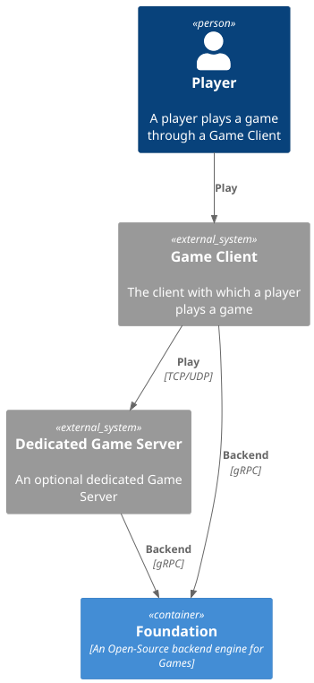
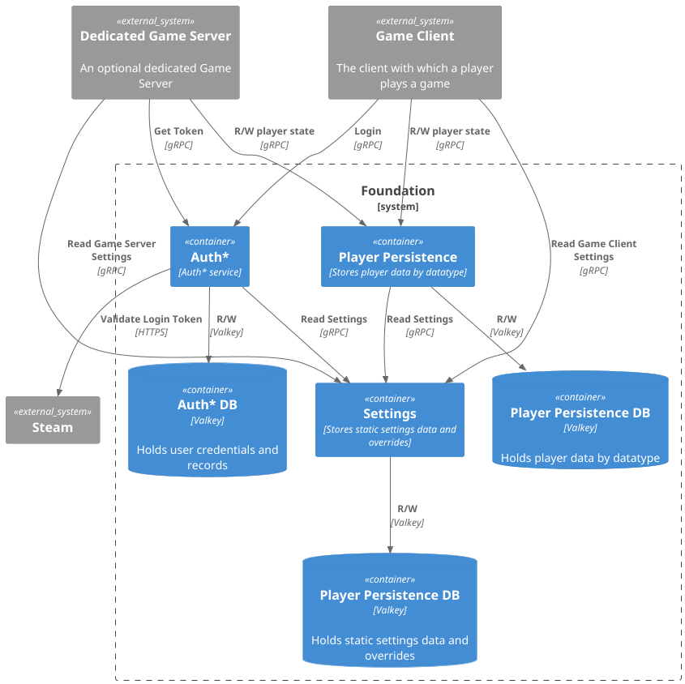

# Architecture

Foundation is designed to be a customizable and pluggable engine. In basic cases, we fully intend that a deployment may
be used without any customization of Foundation's code by simply implementing the gRPC endpoints we expose to handle the
various points at which customization can occur.

Equally, as full source is included, customizations may be made to how it works as long as they comply with the agreed
license (AGPL3.0 or custom license).

## Overview

## Container View

Foundation is built upon a Microservice Architecture, and is intended to be deployed on Kubernetes. Using Kubernetes
provides service discovery, load balancing and automatic failure detection and recovery, along with many other features,
making Foundation a much more resilient and straightforward product to work with.

